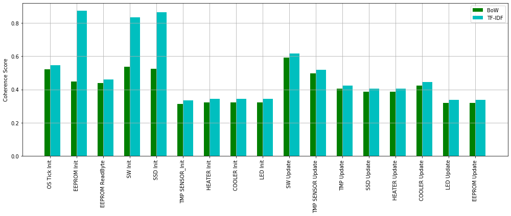

# Feature and Requirement Extraction for Embedded Software

This repository contains code to analyze `.c` files from the `Electric-Water-Heater-main` directory, identify significant functions and global variables, filter functional and non-functional requirements, and visually compare the coherence of two different methods. Results are visualized in bar graphs comparing the coherence of BoW (Bag of Words) and TF-IDF for both Electric Water Heater and Microwave System.

## Prerequisites

Ensure you have the following libraries installed:

- `transformers`: For the BERT and Roberta models and tokenizers.
- `torch`: PyTorch for deep learning.
- `sklearn`: For cosine similarity function.
- `matplotlib`: For plotting results.

You will also need `.c` files placed in the `Electric-Water-Heater-main` directory.

## How to Run

1. Clone this repository.
2. Ensure you have the required libraries installed.
3. Run the provided Python script.
4. The script will process the `.c` files, identify features and requirements, and visualize the results.

## Results

The following are the visualized results of our analysis:

### Electric Water Heater

### Microwave System

### Application Interface

The user interface of FeaMod is intuitive and easy to use, facilitating the management and visualization of feature models. Here's a glimpse of what the FeaMod interface looks like:

In this interface, users can:

- Upload Embedded Source Code files to generate feature model.
- View the generated feature model in a visually appealing and informative format.
- Navigate through different features and their relationships easily.

---

